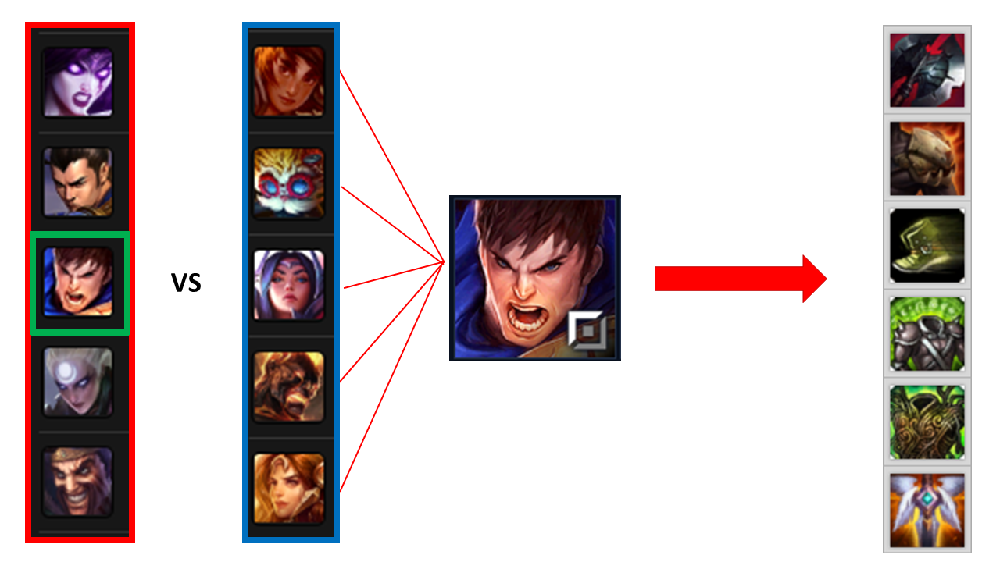

## Data Mining for Item Recommendation in MOBA Games

This repository contains the implementation of the Recommender System Based on Classifiers (Section 4.3). 



### Results

Original result from [our paper](https://dl.acm.org/doi/10.1145/3298689.3346986):

| Method | Precision | Recall | F1-Score | MAP | MRR |
|----------|----------|----------|----------|----------|----------|
| D Tree@1 | 0.65 | 0.17 | 0.27 | 0.64 | 0.64 |
| Logit@1  | 0.67 | 0.18 | 0.28 | 0.67 | 0.67 |
| ANN@1    | 0.71 | 0.19 | 0.30 | 0.71 | 0.71 |
| D Tree@3 | 0.47 | 0.37 | 0.41 | 0.71 | 0.73 |
| Logit@3  | 0.53 | 0.42 | 0.46 | 0.74 | 0.76 |
| ANN@3    | 0.60 | 0.48 | 0.52 | 0.78 | 0.79 |
| D Tree@6 | 0.32 | 0.50 | 0.38 | 0.69 | 0.75 |
| Logit@6  | 0.37 | 0.59 | 0.43 | 0.71 | 0.78 |
| ANN@6    | 0.44 | 0.69 | 0.53 | 0.74 | 0.81 |

### Citation

If you find this repository useful for your research, please consider citing our paper: 
```
@inproceedings{10.1145/3298689.3346986,
	author = {Araujo, Vladimir and Rios, Felipe and Parra, Denis},
	title = {Data Mining for Item Recommendation in MOBA Games},
	year = {2019},
	isbn = {9781450362436},
	publisher = {Association for Computing Machinery},
	address = {New York, NY, USA},
	url = {https://doi.org/10.1145/3298689.3346986},
	doi = {10.1145/3298689.3346986},
	booktitle = {Proceedings of the 13th ACM Conference on Recommender Systems},
	pages = {393–397},
	numpages = {5},
	keywords = {item recommendation, MOBA games, data mining},
	location = {Copenhagen, Denmark},
	series = {RecSys ’19}
}
```
